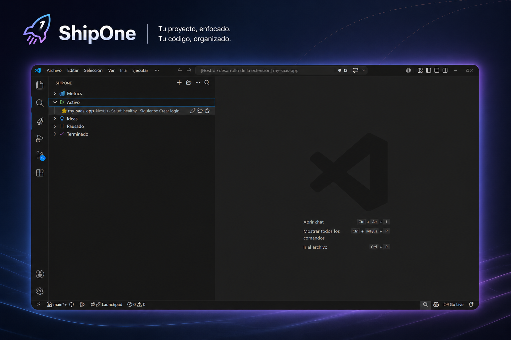

# ShipOne

ShipOne es una extensión de VS Code para crear, organizar y terminar proyectos sin perder el foco.

Convierte ideas sueltas en proyectos con contexto, siguiente paso y estado claro.

En una frase: ShipOne te ayuda a volver a un proyecto y saber enseguida qué sigue.

- Un solo proyecto `Active` a la vez.
- `STATUS.md` y metadata local sincronizados.
- Focus mode, review y salud del proyecto en la misma vista.

Sirve para:

- rescatar proyectos atascados;
- mantener contexto sin abrir mil notas;
- trabajar con una sola prioridad visible.



## Filosofia

ShipOne no intenta ser una herramienta mas para empezar cosas y dejarlas a medias.

Su idea es simple:

- una vista clara;
- pocas acciones;
- menos proyectos abiertos;
- mas contexto visible;
- un siguiente paso claro;
- un flujo que ayude a terminar.

## Problema

Muchos proyectos se quedan dispersos:

- no hay un siguiente paso claro;
- el contexto vive en notas sueltas;
- el estado real del proyecto se olvida;
- el foco se pierde cuando hay demasiadas cosas abiertas.

ShipOne junta esa informacion en un solo sitio para que volver al trabajo sea mas rapido.

## Quick start

1. Clona o abre este repo en VS Code.
2. Ejecuta `npm.cmd run compile`.
3. Pulsa `F5` para abrir Extension Development Host.
4. Abre la vista `ShipOne` y prueba `Crear rapido`.

## Qué hace

- Crea proyectos nuevos desde una vista propia.
- Guarda metadata local de cada proyecto.
- Mantiene un solo proyecto `Active` si activas esa regla.
- Muestra `nextAction`, favoritos, salud, pausas y métricas.
- Genera `STATUS.md` y plantillas minimas por tipo de proyecto.

## Screenshots

Vista principal de ShipOne:


## GIF demo

Demo en movimiento:

- pendiente de grabar
- mostrara crear, abrir y revisar un proyecto
- para la publicacion estable

## Flujo rapido

1. Pulsa `F5` en VS Code.
2. Abre la vista `ShipOne` en la barra lateral.
3. Usa `Crear rapido`, `Crear avanzado`, `Abrir proyecto` o `Buscar proyecto`.
4. Si un proyecto se queda atascado, usa `Congelar proyecto` o `Weekly review`.

## Comandos utiles

- `ShipOne: Crear` - crea proyecto nuevo
- `ShipOne: Abrir` - abre un proyecto
- `ShipOne: Buscar` - filtra proyectos por nombre o etiqueta
- `ShipOne: Focus` - entra en focus mode
- `ShipOne: Weekly review` - revisa el estado semanal
- `ShipOne: STATUS.md` - sincroniza el archivo de estado
- `ShipOne: Conectar GitHub` - conecta GitHub para publicar repos

## Configuración

Empieza por estos ajustes:

- `shipone.projectsRoot` - carpeta base de tus proyectos
- `shipone.defaultProjectType` - tipo que ShipOne propone primero
- `shipone.defaultVisibility` - repo privado o publico por defecto
- `shipone.defaultPackageManager` - npm, pnpm o yarn
- `shipone.openAfterCreate` - abre el proyecto al terminar

Si trabajas con un flujo más estricto:

- `shipone.createGitRepoByDefault` - crea Git local por defecto
- `shipone.createGitHubRepoByDefault` - crea repo en GitHub por defecto
- `shipone.enforceOneActiveProject` - mantiene un solo proyecto `Active`
- `shipone.createStatusFileByDefault` - genera `STATUS.md`
- `shipone.showFinishedProjects` - muestra proyectos terminados
- `shipone.inactiveWarningDays` - días para avisar inactividad
- `shipone.staleWarningDays` - días para aviso fuerte de stale

## Desarrollo

```powershell
npm install
npm.cmd run compile
```

## Solución de problemas

- Si falla `npm.cmd run compile`, revisa que Node y TypeScript estén instalados.
- Si `F5` no abre la extension, verifica que el workspace sea este repo y que no haya errores de compilacion.
- Si GitHub no conecta, comprueba `gh auth status` y el secreto `VSCE_PAT`.

## FAQ

**ShipOne requiere GitHub?**
No. Puede trabajar solo con Git local.

**Necesito usar `STATUS.md`?**
No. ShipOne lo crea y sincroniza, pero no te obliga a tocarlo.

**Puedo tener varios proyectos activos?**
No si tienes activada la regla de un solo `Active`.

## Roadmap

Lo siguiente que queremos cerrar:

- grabar el GIF demo;
- pulir capturas y texto publico;
- preparar la publicacion estable.

## Publicación

Flujo simple:

1. Publica una beta con `vX.Y.Z-beta.N`.
2. Comparte la beta y recoge feedback.
3. Corrige lo importante.
4. Sube la version estable con el workflow `Publish Marketplace`.
5. Usa `VSCE_PAT` como secreto de GitHub para publicar.

## Contribuir

Lee [CONTRIBUTING.md](CONTRIBUTING.md) antes de abrir un PR.

## Notas

- Los assets de marca estan en `media/branding/`.
- ShipOne usa `STATUS.md` como apoyo, pero no obliga a usarlo.
