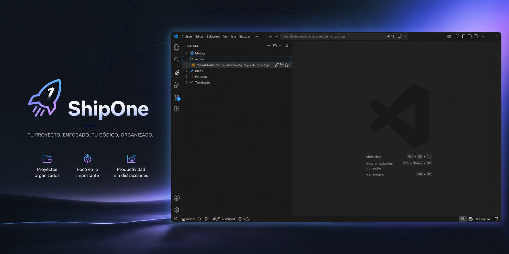
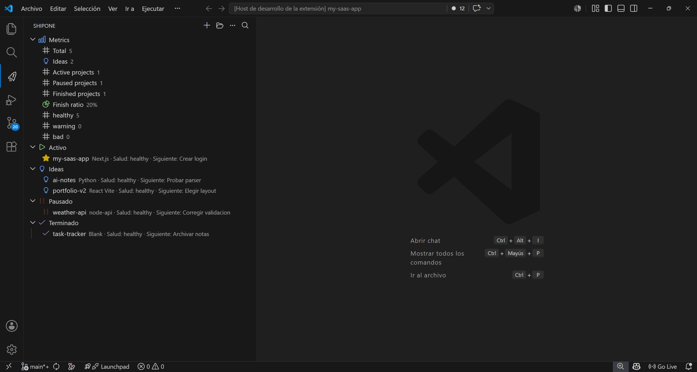
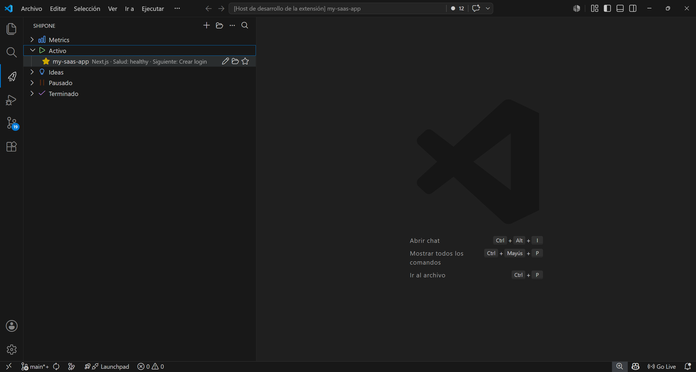
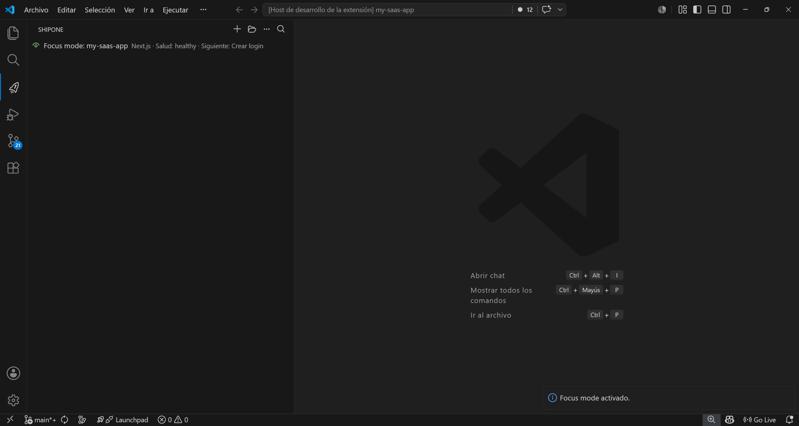

#  ShipOne

ShipOne es una extension de VS Code para crear, organizar y terminar proyectos con contexto claro.

Mantiene un siguiente paso visible, un estado preciso y menos friccion al volver a trabajar.

<p align="center">
  
</p>

## Proposito

Muchos proyectos se empiezan rapido y se abandonan igual de rapido.

ShipOne junta en un solo sitio lo que normalmente queda repartido entre notas, carpetas sueltas y memoria:

- un solo proyecto `Active` a la vez;
- `STATUS.md` y metadata local sincronizados;
- focus mode, review y salud del proyecto en la misma vista;
- Git y GitHub opcionales;
- una lista clara de proyectos por estado.

## Identidad visual

ShipOne usa una identidad visual simple y consistente:

- icono propio en la vista de VS Code;
- banner para Marketplace;
- preview visual para la pagina del producto.

## Capturas

Estas imagenes muestran el flujo real de ShipOne dentro de VS Code:

### Vista general



### Proyecto activo



### Focus mode



## Que hace

- Crea proyectos nuevos desde una vista propia.
- Guarda metadata local de cada proyecto.
- Mantiene un solo proyecto `Active` si activas esa regla.
- Muestra `nextAction`, favoritos, salud, pausas y metricas.
- Genera `STATUS.md` y plantillas minimas por tipo de proyecto.

## Como empezar

1. Abre el repo en VS Code o instala ShipOne desde Marketplace.
2. Ejecuta `npm.cmd run compile` para desarrollo local.
3. Pulsa `F5` para abrir Extension Development Host.
4. Abre la vista `ShipOne` en la barra lateral.
5. Usa la vista `ShipOne` o `ShipOne: Crear` para crear un proyecto.
6. Escribe `nextAction` y trabaja desde la misma vista.
7. Si un proyecto se queda atascado, usa `Congelar proyecto` o `Weekly review`.

## Comandos utiles

- `ShipOne: Crear` - crea proyecto nuevo
- `ShipOne: Abrir` - abre un proyecto
- `ShipOne: Buscar` - filtra proyectos por nombre o etiqueta
- `ShipOne: Focus` - entra en focus mode
- `ShipOne: Weekly review` - revisa el estado semanal
- `ShipOne: STATUS.md` - sincroniza el archivo de estado
- `ShipOne: Conectar GitHub` - conecta GitHub para publicar repos

## Estados

ShipOne trabaja con cuatro estados:

- `idea`
- `active`
- `paused`
- `finished`

Regla principal:

- solo puede haber un proyecto `Active` si tienes activada esa opcion.

## Configuracion

Los ajustes mas utiles son estos:

- `shipone.projectsRoot` - carpeta base de tus proyectos
- `shipone.defaultProjectType` - tipo que ShipOne propone primero
- `shipone.defaultVisibility` - repo privado o publico por defecto
- `shipone.defaultPackageManager` - npm, pnpm o yarn
- `shipone.openAfterCreate` - abre el proyecto al terminar
- `shipone.createGitRepoByDefault` - crea Git local por defecto
- `shipone.createGitHubRepoByDefault` - crea repo en GitHub por defecto
- `shipone.enforceOneActiveProject` - mantiene un solo proyecto `Active`
- `shipone.createStatusFileByDefault` - genera `STATUS.md`
- `shipone.showFinishedProjects` - muestra proyectos terminados
- `shipone.inactiveWarningDays` - dias para avisar inactividad
- `shipone.staleWarningDays` - dias para aviso fuerte de stale

## Requisitos

- VS Code
- Node.js y npm para desarrollo local
- Git para usar repos locales
- GitHub CLI para crear repos en GitHub desde la extension
- `VSCE_PAT` para publicar en Marketplace

## Desarrollo local

```powershell
npm install
npm.cmd run compile
```

## Problemas comunes

- Si falla `npm.cmd run compile`, revisa que Node y TypeScript esten instalados.
- Si `F5` no abre la extension, verifica que el workspace sea este repo y que no haya errores de compilacion.
- Si GitHub no conecta, comprueba `gh auth status` y el secreto `VSCE_PAT`.
- Si una carpeta ya existe, ShipOne usa un nombre alternativo para evitar colisiones.

## FAQ

**ShipOne requiere GitHub?**
No. Puede trabajar solo con Git local.

**Necesito usar `STATUS.md`?**
No. ShipOne lo crea y sincroniza, pero no te obliga a tocarlo.

**Puedo tener varios proyectos activos?**
No si tienes activada la regla de un solo `Active`.

**Guarda datos en la nube?**
No. ShipOne trabaja con almacenamiento local de VS Code y herramientas locales opcionales.

## Publicacion

Flujo simple:

1. Publica una beta con `vX.Y.Z-beta.N`.
2. Comparte la beta y recoge feedback.
3. Recoge feedback con `Issues` y el template de `bug report`.
4. Corrige lo importante.
5. Sube la version estable con el workflow `Publish Marketplace`.
6. Usa `VSCE_PAT` como secreto de GitHub para publicar.

## Privacidad

- Los datos del proyecto se guardan de forma local.
- GitHub es opcional.
- No subas secretos, tokens ni `.env`.
- Revisa `SECURITY.md` si vas a reportar un problema sensible.
- `VSCE_PAT` solo se usa para publicar y nunca debe compartirse en publico.

## Contribuir

Lee [CONTRIBUTING.md](CONTRIBUTING.md) antes de abrir un PR.

## Licencia

Consulta `LICENSE`.
